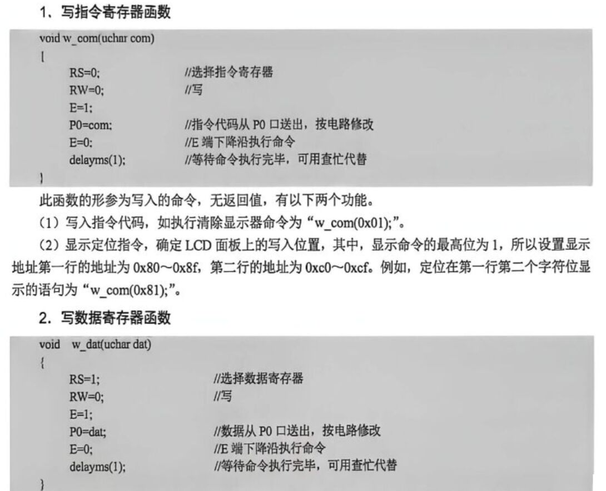
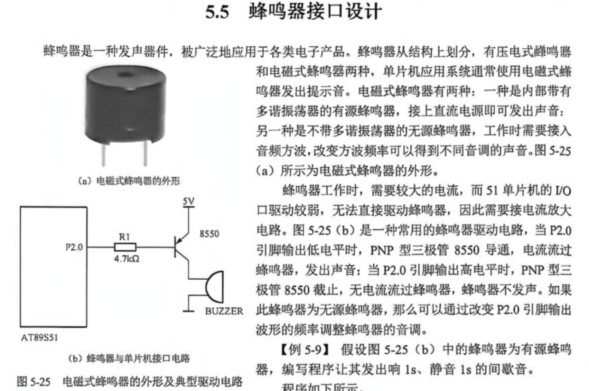

# 51 显示接口

## 数码管结构

LED 数码管由 **8 个发光二极管** 组成：7 个长条形排列成"日"字形 + 1 个圆点作小数点。
每段命名：**a, b, c, d, e, f, g, h**（h 为小数点）

### 共阴极 与 共阳极
**共阴极**：公共端 COM 接地（GND），段控脚输出**高电平**时对应段点亮。驱动方式为拉电流。常见型号如 `LC5011`。

**共阳极**：公共端 COM 接高电平（VCC），段控脚输出**低电平**时对应段点亮。驱动方式为灌电流。常见型号如 `LA5011`。
> 51 单片机驱动共阳数码管更合适（灌电流驱动能力强）。

- `com0～com3`：4 个公共端（位选），决定哪个数码管亮
- `a～h`：8 段线（段选），决定显示什么数字
- 4 位数码管**共用段线**，通过轮流选通 COM 端实现多位显示

---

## 字段码（段码）

以共阳极为例，段控脚输出低电平对应段亮：
| 字符 | 0 | 1 | 2 | 3 | 4 | 5 | 6 | 7 | 8 | 9 |
|------|------|------|------|------|------|------|------|------|------|------|
| 共阳段码 | `0xC0` | `0xF9` | `0xA4` | `0xB0` | `0x99` | `0x92` | `0x82` | `0xF8` | `0x80` | `0x90` |
| 共阴段码 | `0x3F` | `0x06` | `0x5B` | `0x4F` | `0x66` | `0x6D` | `0x7D` | `0x07` | `0x7F` | `0x6F` |
> 共阴 = ~共阳（按位取反）

> C 语言数组：`unsigned char code seg[] = {0x3F,0x06,0x5B,0x4F,0x66,0x6D,0x7D,0x07,0x7F,0x6F};`

---

## 静态显示 vs 动态显示

## 动态显示代码示例

显示可以记江科大这个

```c
unsigned char Number[] = {0x3F, 0x06, 0x5B, 0x4F, 0x66, 0x6D, 0x7D, 0x07, 0x7F, 0x6F, 0x40, 0x00};

// 数码管显示子函数
void Display(unsigned char Location, Num)
{
	switch (Location)
	{
	case 1: P2_2=0; P2_1=0; P2_0=0; break;
	case 2: P2_2=0; P2_1=0; P2_0=1; break;
	case 3: P2_2=0; P2_1=1; P2_0=0; break;
	case 4: P2_2=0; P2_1=1; P2_0=1; break;
	case 5: P2_2=1; P2_1=0; P2_0=0; break;
	case 6: P2_2=1; P2_1=0; P2_0=1; break;
	case 7: P2_2=1; P2_1=1; P2_0=0; break;
	case 8: P2_2=1; P2_1=1; P2_0=1; break;
	}
	P0 = Number[Num]; // 段码输出
    //静态没有下面两个
	Delay(1);				 // 显示一段时间
	P0 = 0x00;				 // 段码清0，消影
}
```

让 8 个数码管显示 1～8：

```c
#include <reg52.h>
#define uchar unsigned char

// 0~9 共阴极段码
uchar code seg[] ={0x3F,0x06,0x5B,0x4F,0x66,0x6D,0x7D,0x07,0x7F,0x6F};

uchar dis[8];  // 显示数组

void delayms(uchar ms)
{
    uchar i;
    while(ms--)
        for(i = 0; i < 123; i++);
}

void display(void)
{
    uchar i;
    for(i = 0; i < 8; i++)
    {
        P0 = seg[dis[i]];   // 段码
        P2 = i;             // 位选（恰好等于循环变量）
        delayms(1);         // 每位亮 1ms
    }
}

void main(void)
{
    while(1)
    {
        dis[0]=1; dis[1]=2; dis[2]=3; dis[3]=4;
        dis[4]=5; dis[5]=6; dis[6]=7; dis[7]=8;
        display();
    }
}
```

## LCD1602（简介）

- 16 字符 × 2 行字符型液晶显示模块
- 通过 8 位数据线 + 3 根控制线（RS、RW、E）操作
- 内置字符发生器 ROM（CGROM），存有 192 个常用字符点阵
- 初始化流程：送功能设置命令 `0x38` → 显示开 `0x0C` → 输入模式 `0x06` → 清屏 `0x01`

```c
// 写指令
void w_com(uchar com)
{
    RS = 0; RW = 0;
    E = 1; P0 = com; E = 0;
    delayms(1);
}

// 写数据
void w_dat(uchar dat)
{
    RS = 1; RW = 0;
    E = 1; P0 = dat; E = 0;
    delayms(1);
}

// LCD 初始化
void lcd_ini(void)
{
    delayms(10);
    w_com(0x38);    // 8 位口，2 行，5×7 点阵
    delayms(10);
    w_com(0x0C);    // 开显示，关光标
    delayms(10);
    w_com(0x06);    // 右移，地址加 1
    delayms(10);
    w_com(0x01);    // 清屏
    delayms(10);
    w_com(0x38);
    delayms(10);
}
```

w_com():命令，位置；w_dat();数据




蜂鸣器看，有源，无源，特性

