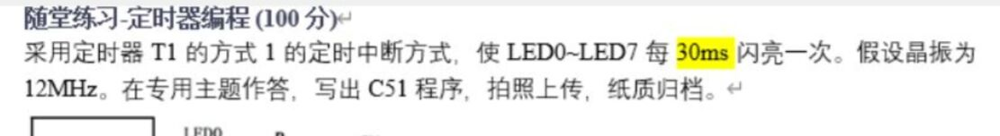

# 51 中断与定时器

## 中断系统

### 5 个中断源

| 中断源 | 说明 | 中断号（m） | 入口地址 |
|------|------|------|------|
| INT0 | 外部中断 0（P3.2） | 0 | 0003H |
| T0 | 定时器 0 溢出 | 1 | 000BH |
| INT1 | 外部中断 1（P3.3） | 2 | 0013H |
| T1 | 定时器 1 溢出 | 3 | 001BH |
| UART | 串行口中断 | 4 | 0023H |

> **2 个优先级**，可实现两级中断嵌套。每个中断源的优先级可用软件（IP 寄存器）设定。

### C51 中断函数声明

```c
void ISR_Name() interrupt m
{
    // 中断服务程序
}
```

其中 `m` 为中断号，由中断源决定。

---

## 中断相关寄存器

### IE — 中断允许控制寄存器

- 字节地址：**0A8H**
- 位地址：**0A8H ~ 0AFH**（可位寻址）

| 位地址 | 0AFH | 0AEH | 0ADH | 0ACH | 0ABH | 0AAH | 0A9H | 0A8H |
|------|------|------|------|------|------|------|------|------|
| 名称 | EA | \ | \ | ES | ET1 | EX1 | ET0 | EX0 |
| 功能 | 中断总允许 | — | — | 串行口中断 | T1 中断 | INT1 中断 | T0 中断 | INT0 中断 |

> 复位后 IE = 00H（所有中断关闭）。
> 中断响应后硬件**不会**自动关闭中断，需软件处理。

**示例**：开串口和 T0，其它禁用：

```c
EA = 1; ES = 1; ET0 = 1;   // 位操作
// 或
IE = 0x92;                   // 寄存器操作
```

### TCON — 定时器控制寄存器

- 字节地址：**88H**
- 位地址：**88H ~ 8FH**（可位寻址）

| 位地址 | 8FH | 8EH | 8DH | 8CH | 8BH | 8AH | 89H | 88H |
|------|------|------|------|------|------|------|------|------|
| 名称 | TF1 | TR1 | TF0 | TR0 | IE1 | IT1 | IE0 | IT0 |
| 功能 | T1 溢出标志 | T1 启停 | T0 溢出标志 | T0 启停 | INT1 标志 | INT1 触发方式 | INT0 标志 | INT0 触发方式 |

> TF1/TF0：中断方式硬件自动清 0，查询方式需软件清 0
> TR1/TR0：1=启动计数，0=停止计数
> IT1/IT0：0=低电平触发，1=下降沿触发

### SCON — 串行口控制寄存器

- 字节地址：**98H**
- 位地址：**98H ~ 9FH**（可位寻址）

| 位地址 | 名称 | 功能 |
|------|------|------|
| 99H | **TI** | 发送完成标志，**必须软件清零** |
| 98H | **RI** | 接收完成标志，**必须软件清零** |

> 硬件不会自动清除 TI/RI，必须在中断服务函数中软件清零！

### IP — 中断优先级控制寄存器

- 字节地址：**0B8H**
- 位地址：**0B8H ~ 0BFH**（可位寻址）

| 位地址 | 0BCH | 0BBH | 0BAH | 0B9H | 0B8H |
|------|------|------|------|------|------|
| 名称 | PS | PT1 | PX1 | PT0 | PX0 |
| 功能 | 串行口优先级 | T1 优先级 | INT1 优先级 | T0 优先级 | INT0 优先级 |

> 0 = 低优先级，1 = 高优先级。复位后均为 0。

---

## 中断优先级与嵌套

### 优先级规则

1. 低优先级中断**不能打断**高优先级中断服务
2. 高优先级**可以打断**低优先级，实现中断嵌套
3. 同优先级中断**不能嵌套**
4. 同优先级同时请求 → 按**硬件查询次序**：

$$INT0(外部中断0) > T0(定时器0) > INT1(外部中断1) > T1(定时器1) > UART(串行口)$$

> 51 单片机只有两级优先级，最多**一层嵌套**。

### 中断响应条件

下列情况会**封锁**中断响应：

1. CPU 正在执行同级或高级的中断服务程序
2. 当前指令**不是**最后一个机器周期
3. 当前指令是 RET、RETI 或访问 IE/IP 的指令

> **关键**：单片机对中断查询结果**不记忆**，被拖延的查询结果将丢失！

---

## 定时器/计数器

### 特性

- 数量：**2 个** 16 位可编程定时/计数器（T0、T1）
- 核心：16 位**加 1 计数器**（THx + TLx）
- 工作模式：**定时**（对片内时钟计数）| **计数**（对外部脉冲计数）
- 计满溢出时发出中断申请（TF0/TF1）

### TMOD — 定时器方式选择寄存器

- 字节地址：**89H**（不可位寻址）

| 高 4 位（T1） | 低 4 位（T0） | 说明 |
|------|------|------|
| GATE | C/T | 门控位 / 定时/计数选择 |
| M1 | M0 | 工作方式选择 |

| M1 | M0 | 方式 | 位数 | 计数范围 |
|------|------|------|------|------|
| 0 | 0 | **方式 0** | 13 位 | 1～8192 |
| 0 | 1 | **方式 1** | 16 位 | 1～65536 |
| 1 | 0 | **方式 2** | 8 位自动重装 | 1～256 |
| 1 | 1 | **方式 3** | T0 拆为两个 8 位 | — |

---

## 四种工作方式

### 方式 0（13 位定时/计数）

- 计数范围：**1～8192**（$2^{13}$）
- 定时时间：$(8192 - 计数值) \times 机器周期$

```c
// 12MHz 晶振，定时 5ms（计数 5000 次）
#define count  5000
#define TH0_X  (8192 - count) / 32    // 高 8 位
#define TL0_X  (8192 - count) % 32    // 低 5 位
```

### 方式 1（16 位定时/计数）

- 计数范围：**1～65536**（$2^{16}$）
- **最常用**

```c
#define count  5000
#define TH0_X  (65536 - count) / 256   // 高 8 位
#define TL0_X  (65536 - count) % 256   // 低 8 位
```

### 方式 2（8 位自动重装）

- 计数范围：**1～256**（$2^8$）
- THx 存初值，TLx 计数。**溢出后 THx 自动重装到 TLx**
- 适用于：循环定时、固定脉宽脉冲、**波特率发生器**

### 方式 3（仅 T0 可用）

- T0 拆为两个独立 8 位计数器 TL0 和 TH0
- TH0 借用 T1 的 TR1 和 TF1
- TH0 只能作**定时器**，TL0 可定时/计数
- T1 仍可工作于方式 0/1/2

---

## 初值计算

### 通用公式

$$初值 = 2^n - \frac{T_{定时}}{机器周期}$$

$$机器周期 = \frac{12}{f_{osc}}$$

### 示例

| 需求 | 晶振 | 方式 | 初值 |
|------|------|------|------|
| 定时 1ms | 12MHz | 方式 1 | 65536 - 1000 |
| 定时 5ms | 12MHz | 方式 1 | 65536 - 5000 |
| 定时 50ms | 12MHz | 方式 1 | 65536 - 50000 |
| 波特率 9600 | 11.0592MHz | 方式 2 | 256 - 3 = 253 (0xFD) |

### 11.0592MHz 特殊计算

$$初值 X = 65536 - \frac{T_{定时} \times 11.0592MHz}{12}$$

> 11.0592MHz 常用于需精确波特率的串口通信场景。

### 练习：



```c
#include <reg51.h>
#define TL1_X  (65536-30000)%256
#define TH1_X  (65536-30000)/256

void main()
{
    TMOD = 0x10;  // 设置 T1 为方式 1
    TL1 = TL1_X;  // 设置定时器初值
    TH1 = TH1_X;
    EA = 1; ET1 = 1;// 允许 T1 中断
    TR1 = 1;  // 启动 T1
    P1 = 0;   // 默认 P1 输出低电平，8 只灯全亮
    while(1); // 主循环，不能缺
}

void isr_t0( ) interrupt 3  // T1 中断
{
    // 重装初值
    TL1 = TL1_X;  // 设置定时器初值
    TH1 = TH1_X;
    P1 = ~P1;     // 翻转 P1 状态，亮灭互换
}
```


