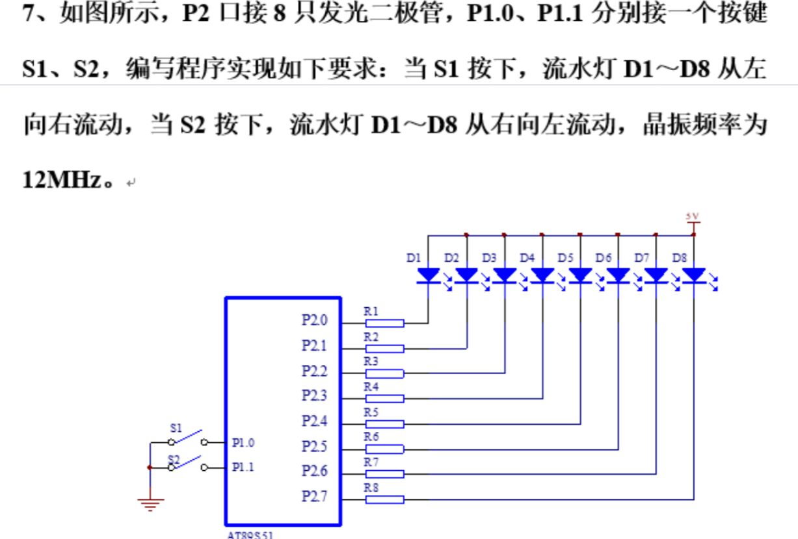

# 刷题1
---

**画图**：51系列单片机最小系统应至少包括**单片机芯片、晶振电路、复位电路、电源**等部分，请在图一将最小系统补充完整。

## 一、填空题

**1**、图一中LED在所接I/O口输出 `低`（高或低）电平时点亮，输出 `高`（高或低）电平时熄灭。

**2**、图一中 S1、S2两个按键，按下时 I/O口将检测到 `低`（高或低）电平，没按下时则检测到 `高`（高或低）电平。

**3**、按键具有机械抖动，可以使用 `硬件` 消抖和 `软件` 消抖方法来消除抖动，单片机控制系统中一般常用 **==软件消抖==** 方法，具体通过延时再确认来实现。

---

**4**、51单片机有 `2` 个中断优先级。对于INT0与INT1两个中断，已知IP=0，则其中优先级较高的是 **==INT0==**；若已知PX0=0，PX1=1，则其中优先级较高的是 **==INT1==**。

**5**、51单片机有 INT0与 INT1两个外部中断，支持两种中断触发方式，分别为 `低电平` 触发和 `下降沿` 触发。

---

**6**、定时/计数器 T0的工作方式 2为 `8` 位初值自动重装定时/计数器。计数值存于 `TL0` 寄存器，初值存于 `TH0` 寄存器。当计数溢出时，T0中断标志位 **==TF0==** 由硬件自动置 1。

---

**7**、串口一共有 `4` 种工作方式。当设置串口为工作方式1时，`TXD(P3.1)` 引脚为串口发送引脚，`RXD(P3.0)` 引脚为串口接收引脚。串口波特率由定时器 `T1` 提供，通常将该定时器设置为定时器工作方式 **==2==**。

**8**、串口通过一个8位的特殊功能寄存器 `SBUF` 收发数据。将数据写入此寄存器可将数据通过串口 **==发送==**（填发送或接收）。

**9**、`RI` 为串口接收中断标志位，为1表示收到一帧数据；`TI` 为串口发送标志位，为1表示一帧数据发送完成。

**10**、串口在工作方式1下，数据帧包括 `1` 位起始位，`8` 位数据位，`1` 位停止位。

---

**11**、PCF8591使用 `I2C` 总线与 51单片机通信，其中，`SCL` 引脚为串行时钟输入，由 51单片机引脚 `P1.1` 提供。SDA引脚为串行数据输入输出，连接到51单片机的 `P1.0` 引脚。

**12**、根据 PCF8591控制字寄存器定义，要求：禁用模拟信号输出，A/D设置为单端输入，使用通道自增1，选择通道0，则控制字节为 **==0x04==**。

---

**13**、51系列单片机最小系统应至少包括 `单片机芯片`、`晶振电路`、`复位电路` 和 `电源` 等部分，请在图四将最小系统补充完整。

**14**、按照公共端的极性，数码管可以分为 `共阴` 极和 `共阳` 极两种，图四中的数码管属于 `共阳` 极，在P2.0引脚输出 `低`（高或低）电平时才可能点亮。

**15**、数码管有 `静态` 显示与 `动态` 显示两种显示方式，当数码管位数较多时，为了节省I/O口，一般使用 **==动态==** 显示方式。

**16**、图四中S1、S2两个按键，按下时I/O口将检测到 `低`（高或低）电平，没按下时则检测到 `高`（高或低）电平。

---

**17**、51单片机有5个中断源，分别是 `INT0(外部中断0)`、定时器T0中断、`INT1(外部中断1)`、`T1` 和串口中断。对于定时器 T0中断与串口中断，已知 IP=0，则其中优先级较高的是 **==T0==**；若已知PT0=0，PS=1，则其中优先级较高的是 **==串口==**。

**18**、51单片机的 INT1中断，支持两种中断触发方式，分别为 `低电平` 触发和 `下降沿` 触发。

---

## 二、计算题

**2**、假设图一中 D1~D8等 LED的正向压降 VF为 2V，LED点亮所需电流 IF为5mA，请问 R1~R8的作用是什么？试计算 R1~R8的值。

作用为：**==限流保护，防止过流烧毁 LED==**

值为：**==600Ω==**

计算过程如下：

$$R = \frac{V_{CC} - V_F}{I_F} = \frac{5V - 2V}{5mA} = \frac{3}{0.005} = 600\Omega$$

---

**3**、根据图三，写出光敏管电压V1与D的关系公式。当D分别为128与192时，V1分别是多少？

$$V_1 = V_{REF} \times \frac{D}{256} = 5 \times \frac{D}{256}$$

- D = 128 时：$V_1 = 5 \times \frac{128}{256} =$ **==2.5V==**
- D = 192 时：$V_1 = 5 \times \frac{192}{256} =$ **==3.75V==**

---

## 三、简答题 / 寄存器配置题

**5**、图一中 S1、S2两个按键为什么可以不使用上拉电阻？如果将 S1、S2连接到 P0口，是否需要上拉电阻？为什么？

> S1、S2 连接到 P1/P2/P3 等准双向口，这些口**内置上拉电阻**，悬空时保持高电平，所以不需要外接。P0口是开漏输出，**没有内置上拉**，必须外接才能确定电平。

---

**3**、IE为中断允许控制寄存器。要求外部中断1和定时器TO中断允许，其他中断禁用，写出配置IE的C51语句，要求有分析过程。

> 分析：EA=1(总开), EX1=1, ET0=1 → `1000 0110` = 0x86

配置语句：`IE = 0x86;`

---

**2**、根据图三推导出PCF8591芯片的读寻址字节、写寻址字节。

> A2/A1/A0 均接地 → 000。PCF8591 高 4 位固定 1001。

- 写地址：**==0x90==**
- 读地址：**==0x91==**

---

**3**、IE为中断允许控制寄存器。要求串口中断和定时器TO中断允许，其他中断禁用，写出配置IE的C51语句，要求有分析过程。

> 分析：EA=1(总开), ES=1, ET0=1 → `1001 0010` = 0x92

配置语句：`IE = 0x92;`

---

## 四、程序补充题

### 简答2：外部中断 INT0 + LED 控制

```c
#include ___①
#define uchar unsigned char
#define uint unsigned int
void DelayXms(uint ms) { uchar i; while(ms--) for(i=0;i<123;i++); }
void main()
{
    IT0 = ___②;
    EX0 = ___③;
    EA  = ___④;
    while(1) { P2 = ___⑤; }
}
void isr_INT0(void) interrupt ___⑥
{
    P2 = ___⑦;
    ___⑧;
    P2 = ___⑨;
    ___⑩;
}
```

| 空号 | 答案 | 说明 |
|------|------|------|
| ① | `<reg51.h>` | 51 头文件 |
| ② | `1` | 下降沿触发 |
| ③ | `1` | 开 INT0 |
| ④ | `1` | 开总中断 |
| ⑤ | `0xFF` | 全灭等待 |
| ⑥ | `0` | INT0 中断号 |
| ⑦ | `0x00` | LED 全亮 |
| ⑧ | `DelayXms(500)` | 延时 0.5s |
| ⑨ | `0xFF` | LED 全灭 |
| ⑩ | `DelayXms(500)` | 延时 0.5s |

### 简答6：按键扫描 + 数码管显示

```c
#include ___①
#define uchar unsigned char
sbit K1 = ___②;
uchar code seg[] = {___}; // ③
void DelayXms(uchar ms) { uchar i; while(ms--) for(i=0;i<123;i++); }
uchar KeyScan(void)
{
    static bit kp = 0;
    if((K1 == 0) && (kp == 0))
    { DelayXms(10); if(K1 == 0) { kp = 1; return 1; } }
    else if((kp == 1) && (K1 != 0)) { kp = ___④; }
    return 0;
}
void ___⑤
{
    uchar key_val = 0, num = 0;
    while(1)
    {
        key_val = ___⑥;
        if(key_val == ___⑦) { num++; if(___⑧) num = 0; }
        ___⑨ = seg[num];
        ___⑩;
    }
}
```

| 空号 | 答案 | 说明 |
|------|------|------|
| ① | `<reg51.h>` | 51 头文件 |
| ② | `P3^2` | 按键接 P3.2 |
| ③ | `{0x3F,0x06,0x5B,0x4F,0x66,0x6D,0x7D,0x07,0x7F,0x6F}` | 0~9 共阴段码 |
| ④ | `0` | 释放后清标志 |
| ⑤ | `main()` | 主函数 |
| ⑥ | `KeyScan()` | 读按键 |
| ⑦ | `1` | 有按键按下 |
| ⑧ | `num > 9` | 超 9 归零 |
| ⑨ | `P0` | 段码送 P0 |
| ⑩ | `DelayXms(10)` | 消抖/刷新 |

### 简答7：外部中断 INT1 + 数码管显示

```c
#include ___①
#define uchar unsigned char
uchar code seg[] = {.....};
void DelayXms(uint ms) { uchar i; while(ms--) for(i=0;i<123;i++); }
void main(void)
{
    IT1 = ___②;
    EX1 = ___③;
    EA  = ___④;
    P2 = 0xFF;
    ___⑤;
}
void isr_INT1(void) interrupt ___⑥ { /* 中断服务 */ }
```

| 空号 | 答案 | 说明 |
|------|------|------|
| ① | `<reg51.h>` | 51 头文件 |
| ② | `1` | 下降沿触发 |
| ③ | `1` | 开 INT1 |
| ④ | `1` | 开总中断 |
| ⑤ | `while(1);` | 主循环等待 |
| ⑥ | `2` | INT1 中断号 |


## 五、程序设计题

**1**、请基于图一所示电路，晶振为12MHz，用C语言编程实现以下功能：当按下S1时，所有LED灯按亮灭各约0.5s的节奏闪烁，按下S2时编号为D1、D3、D5、D7的奇数组 LED与编号为 D2、D4、D6、D8的偶数组 LED交替闪烁，闪烁的亮灭时间各约1s。

```c
#include <reg51.h>

unsigned char Key()
{
    unsigned char num = 0;
    if(P3_2 == 0){Delay(20);while(P3_2==0);Delay(20);num=1;}
    if(P3_3 == 0){Delay(20);while(P3_3==0);Delay(20);num=2;}
    return num;
}

void Delay(unsigned int ms)
{
    unsigned int i,j;
    for(i=0;i<ms;i++)
        for(j=0;j<120;j++);
}

void main()
{
    unsigned char mode = 0;
    unsigned char key;
    P2 = 0xFF;
    while(1)
    {
        key = Key();     
        if(key) mode = key;

        if(mode == 1)
        {
            P2 = 0x00;
            Delay(500);
            P2 = 0xFF;
            Delay(500);
        }
        else if(mode == 2)
        {
            P2 = 0xAA;
            Delay(1000);
            P2 = 0x55;
            Delay(1000);
        }
        else
        {
            P2 = 0xFF;
        }
    }
}

```
---

**2**、采用定时器 T0中断方式实现上述功能，完成 C51程序编写。（LED闪烁0.5s）

```c
#include <reg51.h>

// 计算50ms初值：65536 - 50000 = 15536
#define TL0_X (65536 - 50000) % 256
#define TH0_X (65536 - 50000) / 256

void main()
{
    TMOD = 0x01;  // 设置T0为16位定时器（方式1）
    TL0 = TL0_X;  // 设置初值，定时50ms@12MHz
    TH0 = TH0_X;
    EA = 1;       // 中断总开关使能
    ET0 = 1;      // T0中断使能
    TR0 = 1;      // 启动T0
    while(1);     // 主循环等待中断
}

void isr_t0() interrupt 1   // T0中断服务函数
{
    static unsigned char count = 0;  // 中断计数变量 
    TL0 = TL0_X;  // 重装初值（方式1不会自动重装，必须手动写）
    TH0 = TH0_X; 
    count++;

    if(count >= 20)  // 50ms × 20 = 1000ms = 1s
    {
        count = 0;
        P1  = ~P1 ;  // 翻转LED状态
    }
}

```

---

**5**、51单片机A和51单片机B通过串口通信，A每隔100ms向单片机B发送本人学号的后两位（1个字节）。假设晶振频率为11.0592MHz，试编程实现A的功能。


```c
#include <reg51.h>

void delayms(unsigned int n)  // ms延时函数
{
    unsigned int i, j;
    for(i = 0; i < n; i++)
        for(j = 0; j < 123; j++);  // 本层循环实现延时1ms
}

void main()
{
    SCON = 0x50;   // 设置为串口方式1，允许收/发
    TMOD = 0x20;   // 设置T1为定时方式2，8位初值重载；T1用于产生串口波特率
    TL1 = 0xfd;    // 
    TH1 = 0xfd;    // 9600bps@11.0592MHz 定时初值
    TR1 = 1;       // 启动T1
    while(1)
    {
        SBUF = 23;   // 串口发送学号，假设学号是23
        while(TI == 0);  // 等待发送完成
        TI = 0;      // 清零TI，便于下一次发送
        delayms(100);  // 延时100ms
    }
}

```

---

**6**：基于图四所示电路，设51单片机的晶振频率为12MHz，要求使用定时器To控制数码管以1s间隔从9开始倒数至o，无限循环。采用定时器To中断方式实现上述功能，完成C51程序编写。单位数码管

```c
#include "reg51.h"

// 50ms定时宏定义（12MHz）
#define TL0_X  (65536-50000)%256
#define TH0_X  (65536-50000)/256

// 共阴极数码管段码0~9
unsigned char code seg[] = {0x3F,0x06,0x5B,0x4F,0x66,0x6D,0x7D,0x07,0x7F,0x6F};
unsigned char num = 9;   // 初始显示数字9
unsigned int  cnt = 0;   // 中断计数，20次=1s

void main()
{
    TMOD = 0x01;    // T0配置为16位定时器模式1
    TL0 = TL0_X;    // 装载定时初值
    TH0 = TH0_X;
    EA = 1;         // 开启总中断开关
    ET0 = 1;        // 使能定时器0中断
    TR0 = 1;        // 启动T0定时器
    
    P0 = seg[9];    // 上电默认显示数字9
    while(1);       // 主循环空循环，等待中断触发
}

void isr_t0() interrupt 1
{
    // 重装定时初值，和课件模板完全相同
    TL0 = TL0_X;
    TH0 = TH0_X;
    
    cnt++;
    if(cnt >= 20)
    {
        cnt = 0;
        P0 = seg[num]; // P0输出数码管段码
        num--;
        if(num < 0) num = 9;
    }
}
```

---

**7**：如图一所示电路，设单片机的晶振频率12MHz。要求使用定时器To通过P2.o引脚输出一个周期为10ms、占空比为50%的PWM方波，用于控制某外部设备。请基于To的定时中断方式实现PWM输出功能，定时器的工作方式不限，完成C51程序编写。

```c
#include <reg51.h>

#define TL0_X (65536-5000)%256
#define TH0_X (65536-5000)/256

void main()
{ 
    TMOD = 0x01;   //设置T0为定时器，方式1-16位
    TL0 = TL0_X;   //装载初值
    TH0 = TH0_X;
    EA = 1; //中断总允许打开
    ET0 = 1;//T0中断打开
    TR0 = 1;//启动T0定时器
    while(1);//主循环
}
void isr_t0() interrupt 1
{
    TL0 = TL0_X;
    TH0 = TH0_X;
    P2_0 = ~P2_0; //输出翻转
}

```


# 刷题2

## 作业3

**1、写出外部中断 0/1、定时/计数器 0/1、串口中断的外部引脚是哪些？他们的优先级是什么样的？**

- **答案**：

| 中断源 | 引脚 |
|------|------|
| INT0（外部中断 0） | P3.2 |
| T0（定时/计数器 0） | P3.4 |
| INT1（外部中断 1） | P3.3 |
| T1（定时/计数器 1） | P3.5 |
| 串口 | P3.0(RXD) + P3.1(TXD) |

**优先级（同优先级时硬件查询次序）**：INT0 > T0 > INT1 > T1 > 串口

- **分析**：51 单片机有 2 级中断优先级，通过 IP 寄存器设定。同优先级内按上述硬件查询次序排队，外部中断 0 最高，串口最低。

---

**2、写出定时器的 4 种工作方式，并简述他们各自的特点。**

- **答案**：

| 方式 | 位数 | 计数范围 |
|------|------|------|
| 方式 0 | 13 位 | 1～8192 |
| 方式 1 | 16 位 | 1～65536 |
| 方式 2 | 8 位自动重装 | 1～256 |
| 方式 3 | T0 拆为两个 8 位 | 1～256 |

- **分析**：
  - **方式 0**：TL 只用低 5 位 + TH 全 8 位，兼容早期 8048 系列，现在用得少。
  - **方式 1**：最常用，16 位定时/计数。每次溢出后必须**手动重装** THx/TLx。
  - **方式 2**：TH 存初值，TL 计数；TL 溢出后 TH 值**自动重装**到 TL。适合做串口波特率发生器。
  - **方式 3**：仅 T0 可用，将 T0 拆为两个独立的 8 位计数器（TL0 + TH0），TH0 借用 T1 的 TR1 和 TF1。

---

**3、请写出一个外部中断 0 的初始化程序，要求外部中断 0 使用边沿触发方式。**

```c
#include <reg51.h>

void main(void)
{
    IT0 = 1;    // INT0 边沿触发（下降沿）
    EX0 = 1;    // 使能 INT0 中断
    EA  = 1;    // 开总中断
    while(1);   // 主循环等待中断
}

void isr_INT0(void) interrupt 0   // INT0 中断号 = 0
{
    // 中断服务程序
}
```

---

**4、如图所示，设置系统时钟为 12MHz，编程实现从 P1.0 引脚上输出一个周期为 5ms 的方波，要求使用定时器 1 工作方式 2 进行设计。**

> **分析**：12MHz → 机器周期 1μs。方式 2 最大定时仅 256μs，无法直接做到 2.5ms（半周期）。
> 采用 **250μs 定时 + 软件计数 10 次** = 2.5ms 翻转。
> 初值 = 256 − 250 = **6**。

```c
#include <reg51.h>
sbit P10 = P1^0;

void main(void)
{
    TMOD = 0x20;   // T1 方式 2（8 位自动重装）
    TL1 = 6;       // 初值 = 256 − 250 = 6，定时 250μs
    TH1 = 6;       // 自动重装值
    EA  = 1;       // 开总中断
    ET1 = 1;       // 使能 T1 中断
    TR1 = 1;       // 启动 T1
    while(1);      // 主循环等待中断
}

void isr_t1(void) interrupt 3   // T1 中断号 = 3
{
    static unsigned char count = 0;

    count++;
    if(count >= 10)        // 250μs × 10 = 2.5ms（半周期）
    {
        P10 = ~P10;        // 翻转 → 周期 5ms，占空比 50%
        count = 0;
    }
}
```

> 方式 2 是**自动重装**，ISR 中**不需要**手动重装 TL1/TH1。

---

## 作业4

**1、串口异步通信由哪几部分组成？分别写出串口在工作方式 1 和工作方式 2 时数据帧的组成部分。**

串口异步通信由：**起始位、数据位、校验位（可选）、停止位** 组成。

| 方式 | 帧结构 | 总位数 |
|------|------|------|
| **方式 1** | 1 起始位（0）+ **8 位数据**（D0～D7）+ 1 停止位（1） | **10 位** |
| **方式 2** | 1 起始位（0）+ **9 位数据**（D0～D7 + TB8/RB8）+ 1 停止位（1） | **11 位** |

> 方式 1 是最常用的 8 位异步通信（类似 8N1），方式 2/3 多了第 9 位可用于多机通信或奇偶校验。

---

**2、IIC 的两根线是哪两根线？PCF8591 的控制寄存器的器件地址是怎么样的？**

- **I2C 两根线**：**SDA**（串行数据线）、**SCL**（串行时钟线）
- 都需要**上拉电阻**（开漏输出）

**PCF8591 器件地址**：

| 位 | 7 | 6 | 5 | 4 | 3 | 2 | 1 | 0 |
|------|------|------|------|------|------|------|------|------|
| 含义 | 1 | 0 | 0 | 1 | A2 | A1 | A0 | R/W |
| | 固定标识 | 固定 | 固定 | 固定 | 硬件地址 | 硬件地址 | 硬件地址 | 0=写,1=读 |

- 写地址：`1001 A2A1A0 0`，A 全部接地时 = **==0x90==**
- 读地址：`1001 A2A1A0 1`，A 全部接地时 = **==0x91==**

---

**3、设置一个串口发送程序，要求：工作方式 1，波特率 4800bps，晶振 11.0592MHz，发送数据 0x11～0x88，每间隔 2 秒发送一个，8 个发完后循环。**

> **分析**：11.0592MHz，4800bps，SMOD=0 → 初值 = 256 − 11059200/(384 × 4800) = 256 − 6 = 250 = **0xFA**

```c
#include <reg51.h>

// 发送数据表
unsigned char code table[] =
{0x11, 0x22, 0x33, 0x44, 0x55, 0x66, 0x77, 0x88};

void delayms(unsigned int n)    // ms 延时
{
    unsigned int i, j;
    for(i = 0; i < n; i++)
        for(j = 0; j < 123; j++);
}

void main(void)
{
    unsigned char i;

    SCON = 0x50;   // 串口方式 1，REN=1（允许接收，发/收两用）
    TMOD = 0x20;   // T1 方式 2，8 位自动重装
    TL1 = 0xFA;    // 4800bps @ 11.0592MHz
    TH1 = 0xFA;
    TR1 = 1;       // 启动 T1 产生波特率

    while(1)
    {
        for(i = 0; i < 8; i++)
        {
            SBUF = table[i];       // 发送当前字节
            while(TI == 0);        // 等待发送完成
            TI = 0;                // 软件清零
            delayms(2000);         // 间隔 2 秒
        }
    }
}
```

## 练习
题目+对应答案整理
 
1
 
题目：51单片机的位数是______。
答案：8位
 
2
 
题目：单片机的外接晶振频率为12MHz时，一个机器周期为____；当外接晶振频率为6MHz时，一个机器周期为____。
答案：1μs；2μs
 
3
 
题目：在C51的数据类型中，char型的数据值域为____。
答案：-128~127（signed char，1字节8位）
 
4
 
题目：51系列单片机的CPU由运算器、控制器和布尔处理器组成，主要完成____、____和____等功能。
答案：算术和逻辑运算；程序控制；数据传输与接口管理
 
5
 
题目：51单片机最小系统主要组成部分有：、、、。
答案：单片机芯片、电源电路、时钟电路、复位电路
 
6
 
题目：简述“if…else…语句”，“switch语句”的使用方法。
 
参考答案
 
1. if…else语句
用于分支判断，依靠条件表达式真假选择执行代码：
 
- 单if：条件成立执行内部代码，不成立直接跳过；
- if+else：条件成立执行if代码，不成立执行else代码；
- if…else if…else：多条件依次判断，匹配到第一个成立条件即执行对应代码。
适合区间范围、复杂逻辑比较判断。
 
2. switch语句
用于多固定等值分支判断：
以变量匹配case后的常量值，匹配成功执行对应case内代码；搭配break可跳出分支避免穿透；default用于处理所有case都不匹配的兜底情况。
适合变量等于固定数值的多分支场景。


**8**、如图所示，P2口接8只发光二极管，P1.0、P1.1分别接一个按键S1、S2，编写程序实现如下要求：当S1按下，流水灯D1～D8从左向右流动，当S2按下，流水灯D1～D8从右向左流动，晶振频率为12MHz。



```c
#include <reg51.h>
sbit S1 = P1^0;
sbit S2 = P1^1;

void Delayms(unsigned int ms)    // ms 延时 @ 12MHz
{
    unsigned int i, j;
    for(i = 0; i < ms; i++)
        for(j = 0; j < 123; j++);
}

unsigned char Key()
{
    unsigned char num = 0;
    if(P3_2 == 0){Delay(20);while(P3_2==0);Delay(20);num=1;}
    if(P3_3 == 0){Delay(20);while(P3_3==0);Delay(20);num=2;}
    return num;
}

void main(void)
{
    unsigned char dir = 1;       // 1=左→右, 2=右→左
    unsigned char led = 0xFE;    // 初始：D1 亮 (11111110)
    unsigned char key;
    unsigned char i;

    while(1)
    {
        key = Key();         // 扫描按键
        if(key) dir = key;       // 按下后切换方向

        // 流水灯单步移动
        P2 = led;
        Delayms(200);            // 每步约 200ms

        if(dir == 1)             // 左→右：左移，低位补 1
        {
            led = (led << 1) | 0x01;
            if(led == 0xFF)      // 全灭？从头开始
                led = 0xFE;
        }
        else                     // 右→左：右移，高位补 1
        {
            led = (led >> 1) | 0x80;
            if(led == 0xFF)
                led = 0x7F;      // D8 亮 (01111111)
        }
    }
}
```


# 刷题3

微处理器与接口技术期中测试（题目+标准答案一一对应）
 
一、填空题（共20分，每空1分）
 
1. 题目：P3口中，用于串行通信发送数据的引脚是____，接收数据的引脚是____。
答案：TXD；RXD

2. 题目：8051单片机的复位引脚是____，正常工作状态下该引脚为____电平，输入____电平并维持2个机器周期以上会触发单片机复位。单片机复位电路支持____复位和____复位两种方式。其中，____复位是通过按键并联电解电容实现。
答案：RST；低；高；上电；按键；按键

3. 题目：外部中断0通过____引脚接收中断请求信号，该引脚出现____/下降沿触发中断；外部中断1通过____引脚接收中断请求信号。
答案：P3.2(INT0)；低电平；P3.3(INT1)

4. 题目：P1口内部集成了____电阻，因此可直接作为通用I/O口使用；
答案：上拉

5. 题目：定时器0的外部计数脉冲从P3.4引脚，即____引脚输入；定时器1工作在方式0、1、2时，溢出中断标志位TF1在中断响应后会自动____（自动/手动）清零。
答案：T0；自动

6. 题目：单片机使用____和____引脚间连接晶振，与两个无极性电容共同构成晶振振荡电路。
答案：XTAL1；XTAL2

7. 题目：单片机最小系统是使单片机工作的最小电路单元。单片机的最小系统包括单片机电源、、。
答案：复位电路；时钟电路
 
 
 
二、根据图2独立按键与LED接口电路答题（16分，每空1分）
 
1. 题目：独立按键S1连接到单片机的____引脚，按键闭合时此引脚输入____电平。
答案：P1.0；低

2. 题目：发光二极管D1的负极接单片机的____引脚，此引脚输出____电平时，发光二极管亮，输出____电平时，发光二极管熄灭。
答案：P2.0；低；高

3. 题目：与D1串联的R1电阻为限流电阻，保护二极管使其电流不过大。设D1的导通电压为2V，D1工作电流为10mA，则R1阻值取____。计算式：(5-2)V/10mA=300Ω
答案：300Ω
 
补全按键控制LED代码
 
题目：补全如下逻辑代码
 
if(S1==0 )//判断S1开关是否闭合
{
    LED=0; //点亮LED
}
else //开关未闭合
{
    LED=____; //熄灭LED
}
 
 
答案：1
 
 
 
三、数码管题目（19分，每空1分）
 
1. 题目：数码管显示分为动态显示和____显示。静态显示占用IO少，无需动态刷新。按公共极的接法，数码管分为____数码管和____数码管。共阳极数码管公共极接____电平。
答案：静态；共阴极；共阳极；高

2. 题目：共阴极数码管的公共极接____电平或地。共阳极数码管的公共极接____电平。
答案：低；高

3. 题目：共阳极数码管要显示字符'6'，dp为最高位，段码二进制____，十六进制____；显示字符'1'二进制____，十六进制____。
答案：10000010；0x82；11111001；0xF9

4. 题目：补全按键计数代码，按键按下num自增，到10归零
 
uchar key_val;//按键值变量
uchar num=0;//计数值
while(1)
{
    key_val = key_scan();//按键扫描
    if(key_val==1) //有按键按下
    {
        num=num+1;
        if(num==10)
            num=0;//归零
    }
}
 
 
填空： if(key_val==____) 
答案：1
 
 
 
四、外部中断0编程题（20分，每空2分）
 
题目：图5电路，程序启动8只LED全亮；按下K1触发外部中断0，LED闪烁4次（全亮500ms、全灭500ms）；下降沿触发INT0，补全代码。

```c
#include <reg51.h>
#define uint unsigned int
#define LED P1

void delayms(uint ms)    // ms 级延时 @ 12MHz
{
    uint i, j;
    for(i = 0; i < ms; i++)
        for(j = 0; j < 123; j++);
}

void main()
{
    EA  = ___①;    // 中断总使能
    EX0 = 1;        // 外部中断 0 使能
    IT0 = ___②;    // 外部中断 0 下降沿触发
    LED = 0x00;     // 初始全亮
    while(1);
}

void isr_x0() interrupt ___③
{
    uint i;
    for(i = 0; i < 4; i++)
    {
        LED = 0x00;   delayms(500);
        LED = 0xFF;   delayms(500);
    }
}
```

| 空号 | 答案 | 说明 |
|------|------|------|
| ① | `1` | 开总中断 |
| ② | `1` | 下降沿触发 |
| ③ | `0` | INT0 中断号 = 0 |

五、定时器大题（25分，填空15分+编程10分）
 
填空部分（每空1分）
 
1. 题目：51单片机有2个16位可编程定时器T0、T1。支持两种工作模式：模式和____模式。定时模式计数脉冲来自晶振12分频；计数模式脉冲来自引脚。
答案：定时；计数；T0(P3.4)、T1(P3.5)
2. 题目：外接12MHz晶振，定时模式计数脉冲周期为____μs。
答案：1
3. 题目：T0/T1共____种工作方式；方式0为____位、方式1为____位、方式2为____位；方式____支持初值自动重装，TH存放初值，TL存放计数值。
答案：4；13；16；8；2
4. 题目：12MHz晶振，T0方式1定时10ms，初值公式：65536-；赋值语句：TL0=%256；TH0=____/256
答案：10000；65536-10000；65536-10000
 

**编程题**（10分）：T0 方式 1 定时中断，P1.0 接 LED，每 20ms 翻转一次，12MHz 晶振，LED 初始亮。

```c
#include <reg52.h>
sbit D1 = P1^0;

#define TL0_X  (65536 - 20000) % 256
#define TH0_X  (65536 - 20000) / 256

void main(void)
{
    TMOD = 0x01;   // T0 方式 1
    TL0 = TL0_X;
    TH0 = TH0_X;
    EA = 1;        // 开总中断
    ET0 = 1;       // 开 T0 中断
    TR0 = 1;       // 启动 T0
    D1 = 0;        // 初始点亮
    while(1);
}

void isr_t0() interrupt 1    // T0 中断号 = 1
{
    TL0 = TL0_X;   // 方式 1 必须手动重装初值
    TH0 = TH0_X;
    D1 = ~D1;      // 翻转 LED
}
```