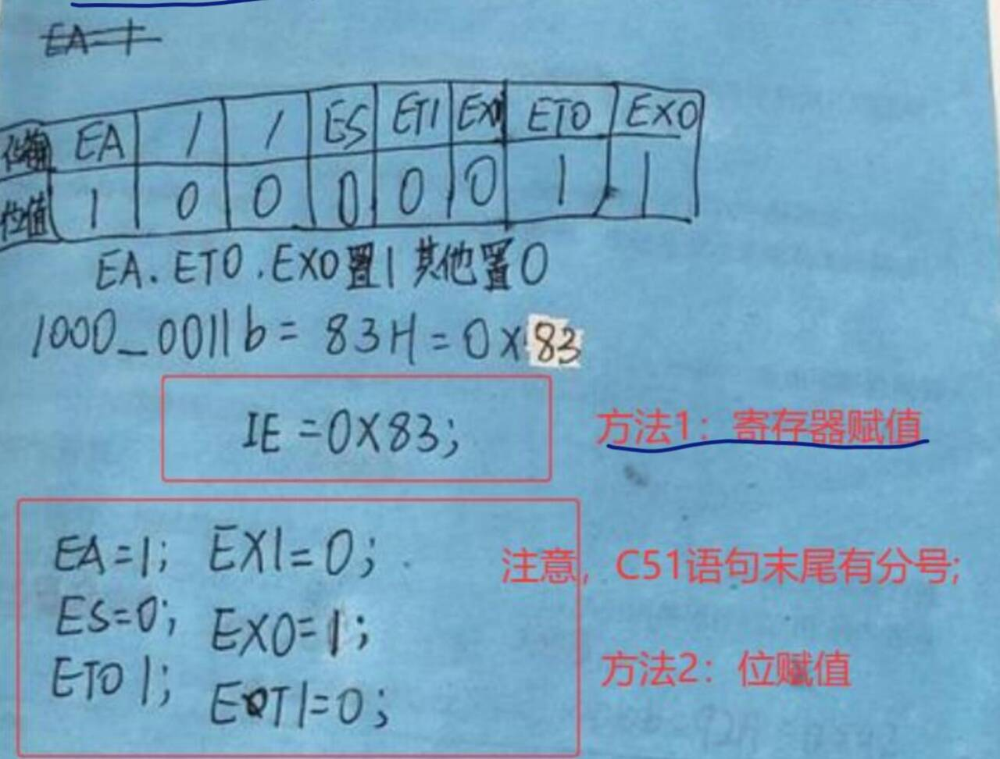
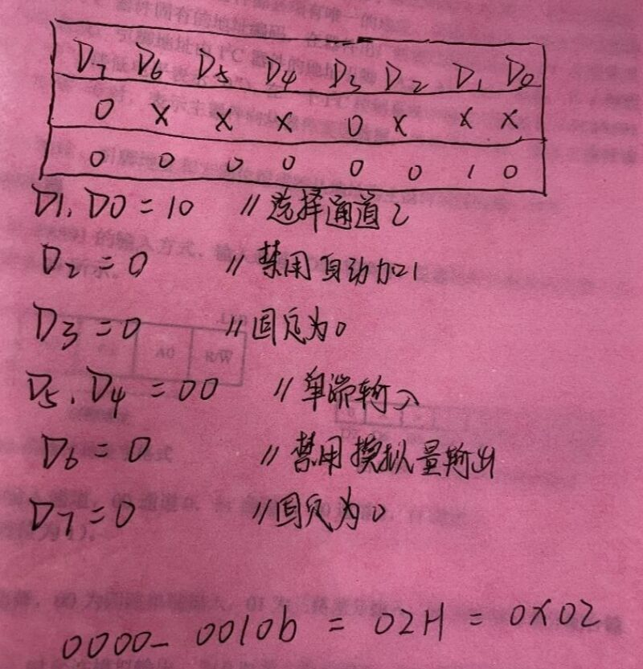

# 重难点

## 1、中断配置 — IE 寄存器

**题目**：配置 IE 寄存器，要求使能外部中断 0、定时器 T0 中断，其余全部禁用，写出分析过程与 C51 代码。

**IE 寄存器位定义**：

| 位地址 | 0AFH | 0AEH | 0ADH | 0ACH | 0ABH | 0AAH | 0A9H | 0A8H |
|------|------|------|------|------|------|------|------|------|
| 符号 | EA | — | — | ES | ET1 | EX1 | ET0 | EX0 |

**分析**：

- EA：总中断开关 → **1**
- EX0：外部中断 0 → **1**
- ET0：定时器 0 中断 → **1**
- ES、ET1、EX1、保留位：全部 → **0**

$$二进制：1000\ 0011 = 0x83$$

**两种写法**：

```c
// 写法1：直接赋值
IE = 0x83;

// 写法2：位操作（更清晰）
EA = 1;
EX0 = 1;
ET0 = 1;
```

---

## 2、PCF8591 控制字节推导

**题目**：PCF8591 控制寄存器：通道 2、禁用自动加 1、单端输入、禁止 DA 模拟输出，推导控制字节。

**位定义**：

| 位 | D7 | D6 | D5 | D4 | D3 | D2 | D1 | D0 |
|------|------|------|------|------|------|------|------|------|
| 功能 | 固定0 | DA输出 | 输入模式 | 输入模式 | 固定0 | 自动递增 | 通道选择 | 通道选择 |
| 取值 | 0 | 0=禁止 | 00=单端 | — | 0 | 0=关闭 | 10=CH2 | — |

**逐位赋值**：

- D7 = 0（固定）
- D6 = 0（禁止 DA）
- D5D4 = 00（单端输入）
- D3 = 0（固定）
- D2 = 0（关闭自动加 1）
- D1D0 = 10（通道 2）

$$二进制：0000\ 0010 = 0x02$$

**控制字节：`0x02`**


---

## 3、定时器 T1 — LED 每 30ms 翻转（12MHz，方式 1）

**题目**：定时器 T1 方式 1 定时中断，P1 口 LED0～LED7 每 30ms 翻转闪烁，晶振 12MHz。

**分析**：

- 12MHz 晶振 → 机器周期 = **1μs**
- 方式 1 最大定时 = 65536μs
- 定时 30ms = 30000μs
- 初值 = 65536 − 30000 = **35536**

```c
TH1 = 35536 / 256;
TL1 = 35536 % 256;
```

**完整代码**：

```c
#include <reg51.h>
#define LED P1

#define TL1_X  (65536 - 30000) % 256
#define TH1_X  (65536 - 30000) / 256

void main(void)
{
    TMOD = 0x10;   // T1 方式 1，16 位定时器
    TL1 = TL1_X;
    TH1 = TH1_X;
    EA = 1;        // 开总中断
    ET1 = 1;       // 使能 T1 中断
    TR1 = 1;       // 启动 T1
    while(1);      // 主循环等待中断
}

void isr_t1(void) interrupt 3   // T1 中断号 = 3
{
    TL1 = TL1_X;   // 方式 1 必须手动重装初值
    TH1 = TH1_X;
    LED = ~LED;    // 翻转所有 LED
}
```

---

## 4、串口编程 — A 每 100ms 发送学号后两位（11.0592MHz，9600bps）

**题目**：51A、51B 串口通信，A 每 100ms 发送 1 字节（学号后两位）；晶振 11.0592MHz，波特率 9600，T1 方式 2。

**分析**：

- 11.0592MHz → 波特率 9600 时 T1 初值 = **0xFD**
- T1 方式 2（8 位自动重装）
- SCON = 0x50（方式 1，允许接收）

**完整代码**：

```c
#include <reg51.h>

void delayms(unsigned int n)
{
    unsigned int i, j;
    for(i = 0; i < n; i++)           // 循环 n 次，每次 1ms
        for(j = 0; j < 123; j++);
}

void main(void)
{
    SCON = 0x50;   // 串口方式 1，REN=1 允许接收
    TMOD = 0x20;   // T1 定时方式 2，8 位自动重装
    TL1 = 0xFD;
    TH1 = 0xFD;    // 9600bps @ 11.0592MHz
    TR1 = 1;       // 启动 T1 产生波特率

    while(1)
    {
        SBUF = 23;           // 发送学号后两位（自行替换）
        while(TI == 0);      // 等待发送完成
        TI = 0;              // 软件清零发送标志
        delayms(100);        // 间隔 100ms
    }
}
```

---

## 5、定时器 T0 — P1.0 输出 1s 周期方波（12MHz，方式 1）

**题目**：晶振 12MHz，T0 方式 1，P1.0 输出周期 1s 方波（高/低电平各 500ms）。

**分析**：

- 单次最大定时 65.536ms，需分多次
- 定 50ms × 10 次 = 500ms 翻转一次
- 初值 = 65536 − 50000 = **15536**

**完整代码**：

```c
#include <reg51.h>
sbit P10 = P1^0;

#define TL0_X  (65536 - 50000) % 256
#define TH0_X  (65536 - 50000) / 256

void main(void)
{
    TMOD = 0x01;   // T0 方式 1，16 位定时器
    TL0 = TL0_X;
    TH0 = TH0_X;
    EA = 1;        // 开总中断
    ET0 = 1;       // 使能 T0 中断
    TR0 = 1;       // 启动 T0
    while(1);      // 主循环等待中断
}

void isr_t0(void) interrupt 1   // T0 中断号 = 1
{
    static unsigned char count = 0;

    TL0 = TL0_X;   // 方式 1 必须手动重装初值！
    TH0 = TH0_X;
    count++;

    if(count >= 10)   // 50ms × 10 = 500ms
    {
        P10 = ~P10;    // 翻转输出
        count = 0;
    }
}
```

> **关键提醒**：方式 1 不是自动重装，每次中断必须手动重装 THx/TLx！方式 2 才是自动重装。
