# 刷题1


## 一、填空题（每空 1 分，共 20 分）

**1**、单片机是微处理器的一种类型，它是将 `____`、存储器和 `____` 集成在一小块硅片上的集成电路。
> **答案**：中央处理器（CPU）；输入输出单元（I/O）

**2**、51 单片机一般采用 12MHz 晶振作为外部时钟输入，则系统的时钟周期为 `____`，机器周期为 `____`；指令周期一般为 `____` 个机器周期。
> **答案**：1/12 μs；1 μs；一个或几

**3**、51 单片机复位后，程序计数器 PC 的值为 `____`，端口寄存器 P1 的值为 `____`。
> **答案**：0x00；0xFF

**4**、使用 KEIL C51 软件编程时，用 `____` 表示一条 C 语句的结束，C51 源文件的扩展名为 `____`。
> **答案**：分号（;）；.c

**5**、A/D 转换器的作用是 `____`，方便单片机进行数据处理。
> **答案**：把模拟量转换为数字量

**6**、若将 4×4 键盘与 51 单片机相连，至少需要使用 51 单片机 `____` 位的输入/输出端口。
> **答案**：8

**7**、一位共阳数码管，显示数字"7"，它的十六进制数段码是 `____`。
> **答案**：0xF8

**8**、中断服务函数修饰符 `interrupt n`，当 n=0 时对应 `____` 中断源，n=2 时对应 `____` 中断源。
> **答案**：外部中断 0；外部中断 1

**9**、外部中断的中断请求有两种信号触发方式，分别是 `____` 触发和 `____` 触发。
> **答案**：电平；脉冲

**10**、51 单片机内有 2 个定时/计数器，每个定时/计数器有 `____` 种工作方式，其中方式 0 为 `____` 位的定时计数器。
> **答案**：4；13

**11**、MCS-51 串行接口有 4 种工作方式，其中方式 `____` 是 10 位异步收发器。
> **答案**：1

**12**、在处理按键抖动的问题上，通常采用 `____` 方式来消除按键抖动。
> **答案**：软件延时消抖 / 软件消抖

---

## 二、单项选择题（每小题 2 分，共 20 分）

**1**、在单片机实验过程中，我们使用程序烧录软件把以下哪种文件下载在单片机中。
> **答案**：D（*.hex）

**2**、STC89C52RC 单片机是（ ）单片机。
> **答案**：B（8 位）

**3**、8051 单片机的 RESET（9）引脚是（ ）引脚。
> **答案**：A（复位）

**4**、执行 `x = 0x44 || 0x22` 后，x 的结果为（ ）。
> **答案**：C（1）

> 逻辑或 `||`，两边非 0 即为真，结果为 1。

**5**、在 8051 单片机系统中，IE 指的是（ ）。
> **答案**：A（中断允许控制寄存器）

**6**、在同时使用多个共阳极数码管进行动态显示时，在每次显示结束后要进行余晖消除，使用的语句是（ ）。
> **答案**：C（P0=0xFF;）

> 共阳数码管，段码输出高电平（0xFF）熄灭，消除残影。

**7**、允许 8051 单片机定时器 T1 中断的语句是（ ）。
> **答案**：D（ET1=1）

**8**、下列哪个器件在于单片机进行通信的时候使用的是 I2C 协议。
> **答案**：A（ADC/DAC PCF8591）

**9**、在串行数据传输过程中，数据只能朝着一个方向传输的通信方式是（ ）。
> **答案**：C（单工）

**10**、51 单片机五个中断源的默认优先级由高到低排列的顺序正确的是（ ）。
> **答案**：B（外部中断 0 > 定时器 T0 > 外部中断 1 > 定时器 T1 > 串行口）

---

## 三、简答题（第 1 小题 6 分，第 2 小题 7 分，第 3 小题 7 分，共 20 分）

### 1、手动上电复位电路原理（6 分）

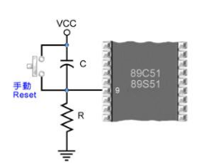

**答案**：

按键弹开时（1分），电容 C 充满电相当于开路（1分），单片机复位管脚（9脚）上输入电压为 **低电平（0V）**（1分）；

当按键按下时（1分），电容 C 快速放电，电容两端电压变为 0V（1分），这时复位管脚（9脚）上输入电压变为 **高电平**，使单片机复位（1分）。

---

### 2、矩阵按键逐行扫描法得到按键值"9"（7 分）

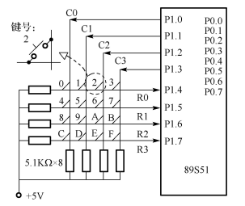

**答案**：

"9"键位于 C1 列 R2 行（1分）。

1. 先让所有**列线输出 0**，即 `P1 = 0xF0`（1分）。"9"键按下时，行线 R2 输入为 0，其他行线为 1，即 `P1 = 0xB0`（1分），得行线值 = 2（1分）。
2. 再让所有**行线输出 0**，即 `P1 = 0x0F`（1分）。"9"键按下时，列线 C1 输入为 0，其他列线为 1，即 `P1 = 0x0D`（1分），得列线值 = 1（1分）。
3. 按键值 = 4 × 行线值 + 列线值 = 4 × 2 + 1 = **9**（1分）。

---

### 3、共阴极数码管段码（7 分）

**答案**（a 为低位，dp 为高位）：

| 数值 | 段码（十六进制） | 得分 |
|------|------|------|
| 0 | 0x3F | 3 分 |
| 2 | 0x5B | 1 分 |
| 4 | 0x66 | 1 分 |
| 7 | 0x07 | 1 分 |

> 注意：原答案说"H（1分）"，是指十六进制后缀格式。0x3F 得 3 分，因为还包括画内部结构图的分数。

---

## 四、应用设计题（每小题 10 分，共 40 分）

> 评分说明：编程题比较灵活，实现功能即可给分。

### 1、流水灯（10 分）

> P2 接 8 只发光二极管，从上至下轮流点亮（每次一个，间隔 500ms），然后从下至上两两一组点亮（每次一组，间隔 300ms），晶振 12MHz。

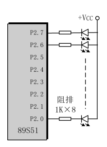

```c
#include <reg51.h>
typedef unsigned int uint;
typedef unsigned char uchar;

// 软件延时函数（12MHz晶振）
void delay_ms(uint ms)
{
    uint i, j;
    for(i = ms; i > 0; i--)
        for(j = 123; j > 0; j--);
}

void main(void)
{
    uchar i;
    while(1)
    {
        // 1. 从上到下轮流点亮单个LED（P2.7 → P2.0）
        for(i = 0; i < 8; i++)
        {
            P2 = ~(0x80 >> i); // 依次拉低P2.7~P2.0
            delay_ms(500);
        }
        
        // 2. 从下到上两两分组点亮（P2.0&P2.1 → P2.6&P2.7）
        for(i = 0; i < 4; i++)
        {
            P2 = ~(0x03 << (i*2)); // 依次拉低P2.0&P2.1、P2.2&P2.3...
            delay_ms(300);
        }
    }
}
```

---

### 2、定时器补充程序（10 分，每空 1 分）

> T0 方式 0 定时 2s（P1.2 LED 亮灭交替）；T1 方式 1 定时 1s（P1.5 LED 亮灭交替）。晶振 12MHz。

```c
#include <reg52.h>
#define uchar unsigned char
#define uint unsigned int
___①___
___②___
uchar con1 = 0;
uint con2 = 0;

void main(void)
{
    TMOD = ___③___;
    TH0 = (8192 - 5000) / 256;
    TL0 = (8192 - 5000) % 256;
    TH1 = (65536 - 50000) / 256;
    TL1 = (65536 - 50000) % 256;
    TR0 = 1; TR1 = 1;
    EA = 1; ET0 = 1; ET1 = 1;
    ___④___
}

void timer1(void) interrupt ___⑤___
{
    TH1 = (65536 - 50000) / 256;
    TL1 = (65536 - 50000) % 256;
    if(++con1 == 20)
    {
        ___⑥___
        ___⑦___
    }
}

void timer0(void) interrupt 1
{
    TH0 = (8192 - 5000) / 256;
    TL0 = (8192 - 5000) % 256;
    if(++con2 == ___⑧___)
    {
        ___⑨___
        ___⑩___
    }
}
```

| 空号 | 答案 | 说明 |
|------|------|------|
| ① | `sbit LED2 = P1^2;` | 定义 P1.2 对应 2s LED |
| ② | `sbit LED5 = P1^5;` | 定义 P1.5 对应 1s LED |
| ③ | `0x10` | T1 方式 1（16 位）+ T0 方式 0（13 位） |
| ④ | `while(1);` | 主循环等待中断 |
| ⑤ | `3` | T1 中断号 = 3 |
| ⑥ | `con1 = 0;` | 计数清零 |
| ⑦ | `LED5 = ~LED5;` | P1.5 翻转（1s 亮灭） |
| ⑧ | `400` | T0 方式 0，5000μs × 400 = 2s |
| ⑨ | `con2 = 0;` | 计数清零 |
| ⑩ | `LED2 = ~LED2;` | P1.2 翻转（2s 亮灭） |

---

### 3、串口发送 + 按键（10 分）

> P3.3 接按键（按下低电平），按下后将 0x16 通过串行口方式 1 发送到 PC，波特率 9600，晶振 11.0592MHz。

```c
#include <reg51.h>
sbit KEY = P3^3;

void delayms(unsigned int ms)
{
    unsigned int i, j;
    for(i = 0; i < ms; i++)
        for(j = 0; j < 123; j++);
}

void main()
{
    // 串口初始化
    SCON = 0x50;        // 方式 1，REN=1
    TMOD = 0x20;        // T1 方式 2
    TH1 = 0xFD;         // 9600bps @ 11.0592MHz
    TL1 = 0xFD;
    TR1 = 1;            // 启动波特率发生器

    while(1)
    {
        if(KEY == 0)           // 按键按下
        {
            delayms(20);       // 消抖
            if(KEY == 0)
            {
                SBUF = 0x16;   // 发送数据
                while(TI == 0); // 等待发送完成
                TI = 0;        // 清标志
                while(KEY == 0); // 等待按键弹起
            }
        }
    }
}
```

---

### 4、数码管按键计数（10 分）

> 共阴数码管接 P0（段码）+ 38 译码器（P2.2/P2.1/P2.0 位选），独立按键 P3.0（清零）和 P3.1（加一）。
> 初始显示"000"，加一键每按一次+1，到 1000 回 0；清零键显示归 0。

```c
#include <reg52.h>
#define uint unsigned int
#define uchar unsigned char

sbit c    = P2^2;
sbit b    = P2^1;
sbit a    = P2^0;
sbit qing = P3^0;      // 清零键
sbit jia  = P3^1;      // 加一键

uchar code CCseg[] =
{0x3F,0x06,0x5B,0x4F,0x66,0x6D,0x7D,0x07,0x7F,0x6F};

void delayms(uint ms)
{
    uint a;
    while(ms--)
        for(a = 0; a < 122; a++);
}

void xianshi(uint m)
{
    // 显示百位
    c = 0; b = 0; a = 0;
    P0 = CCseg[m / 100];
    delayms(1);
    P0 = 0x00;                   // 消隐

    // 显示十位
    c = 0; b = 0; a = 1;
    P0 = CCseg[(m / 10) % 10];
    delayms(1);
    P0 = 0x00;

    // 显示个位
    c = 0; b = 1; a = 0;
    P0 = CCseg[m % 10];
    delayms(1);
    P0 = 0x00;
}

void main()
{
    uint shu = 0;
    while(1)
    {
        xianshi(shu);

        // 清零键
        if(qing == 0)
        {
            delayms(10);         // 消抖
            if(qing == 0)
            {
                shu = 0;         // 清零
                while(qing == 0) xianshi(shu);  // 等待弹起
            }
        }

        // 加一键
        if(jia == 0)
        {
            delayms(10);         // 消抖
            if(jia == 0)
            {
                shu++;
                if(shu == 1000)
                    shu = 0;     // 到 1000 回零
                while(jia == 0) xianshi(shu);   // 等待弹起
            }
        }
    }
}
```

> 原卷填空对应：`① P0 = CCseg[m/100]`（百位段码）、`② c=0;b=0;a=1`（十位选通）、`③ P0 = CCseg[(m/10)%10]`（十位段码）、`④ P0 = CCseg[m%10]`（个位段码）、`⑤ if(qing==0)`、`⑥ shu=0`、`⑦ if(jia==0)`、`⑧ shu++`、`⑨ shu=0`、`⑩ while(jia==0) xianshi(shu)`（等待弹起）


# 刷题2

> 各章节复习题库（题目 + 答案）

---

## 第 1 章 · 微处理器技术简介

**1**、`(D5.2A)H` 转换成二进制数是 `____`。
> **答案**：(11010101.00101010)B

**2**、十六进制数 `(1524)H` 转换成二进制数是 `____`。
> **答案**：(0001 0101 0010 0100)B

**3**、二进制数 `(1101011011)B` 转换成十六进制数是 `____`。
> **答案**：(35B)H

**4**、51 单片机是 `____` 位的单片机。
> **答案**：8

**5**、单片机的主要组成部分有 `____`。
> **答案**：中央处理器(CPU)、存储器、I/O 接口

**6**、51 单片机引脚的高、低逻辑电平各是 `____`。
> **答案**：+5V，0V

**7**、单片机的定义：`____`。

**8**、单片机的应用系统由 `____` 组成。
> **答案**：硬件系统和软件系统

**9**、51 单片机的可执行文件是 `____`。
> **答案**：*.hex

**10**、实验课程中使用的单片机型号是 `____`。
> **答案**：89C52

**11**、51 单片机管脚的电平种类有 `____` 和 `____`。
> **答案**：高电平；低电平

**12**、51 单片机引脚输出的信号是 `____` 电平。
> **答案**：TTL

**13**、51 单片机的编程工具是 `____`。
> **答案**：Keil uVision

---

## 第 3 章 · MCS-51 系列单片机基本结构

**1**、单片机的 `____` 口作为普通 I/O 口使用，用作输出时必须外接上拉电阻；`____` 口可以不外接上拉电阻。
> **答案**：P0；P1、P2、P3

**2**、单片机有 4 个 `____` 位并行 I/O 口，其中驱动负载能力最大的是 `____` 口。
> **答案**：8；P0

**3**、单片机的最小系统是 `____`，由 `____` 组成，画出其最小系统电路图。
> **答案**：能使单片机正常工作的最小硬件单元电路；单片机、电源电路、复位电路及晶振电路

**4**、51 单片机的 CPU 由 `____` 组成。
> **答案**：运算器和控制器

**5**、51 单片机存储器分为 `____`。
> **答案**：程序存储器和数据存储器

**6**、单片机的应用程序一般放在 `____`。
> **答案**：ROM

**7**、51 单片机外接 12MHz 晶振时，一个机器周期为 `____`；外接 24MHz 时，一个机器周期为 `____`。
> **答案**：1μs；0.5μs

**8**、单片机四个周期的关系。

**9**、单片机的复位电路有 `____` 两种。
> **答案**：上电复位和手动复位

**10**、51 单片机 I/O 口作输入功能前，首先必须 `____`，以免过大电流灌入损坏引脚驱动器。
> **答案**：写 1

**11**、51 单片机程序计数器 PC 是一个 16 位专用寄存器，其寻址空间最大是 `____`。
> **答案**：64K

**12**、如果 51 单片机从内部程序存储器启动，那么 EA 引脚为 `____`。
> **答案**：高电平

**13**、51 单片机可外扩的程序存储器最大是 `____`。
> **答案**：64K

---

## 第 5 章 · 单片机 C51 语言程序设计

**1**、`unsigned char` 类型的数据长度及范围是 `____`；`signed char` 的数据长度及范围是 `____`。`unsigned int` 为 `____`。
> **答案**：8 位(单字节)，0～255；8 位(单字节)，-128～127；16 位(双字节)，0～65535

**2**、一个 C51 程序必须包含 `____`。
> **答案**：一个主函数（main 函数）

**3**、C 程序中的注释可以放在 `____`。
> **答案**：任何位置

**4**、一个 C 程序可以由 `____` 或 `____` 个函数组成。
> **答案**：一个；多个

**5**、C 程序的基本组成单位是 `____`。
> **答案**：函数

**6**、C51 程序是从 `____` 开始执行的。
> **答案**：主函数（main 函数）

**7**、表达式 `P2 &= 0xF0` 实现的功能是 `____`。
> **答案**：将 P2 口的低 4 位置为低电平

**8**、假设 i=2，执行 `while(i>5)` 时，循环执行 `____` 次。
> **答案**：0

**9**、定义一个可位寻址的变量 BEEP 访问 P1 口的 P1.6 引脚的语句是 `____`。
> **答案**：`sbit BEEP = P1^6;`

**10**、C51 程序中常把 `____` 作为循环体，产生延时的效果。
> **答案**：空语句

**11**、if 语句的使用（结合按键、LED），延时函数的编写等。
```c
void delayms(uchar ms)
{
    uchar r;
    while(ms--)
        for(i = 0; i < 123; i++);
}
```

**12**、现有 `char a[] = “HELLO”` 和 `char b[] = {‘H’,’E’,’L’,’L’,’O’}`，数组 a 和 b 的长度情况为 `____`。
> **答案**：a 比 b 的长度长（a 有 `\0` 结束符，长度 6；b 长度 5）

**13**、表达式语句是由 `____` 和 `____` 组成。
> **答案**：表达式；分号

---

## 第 6 章 · 人机接口设计

**1**、按键由于机械结构特性会出现 `____`，消抖的常用方法有 `____`。
> **答案**：抖动；硬件去抖和软件去抖

**2**、一单片机应用系统需使用 10 个按键，采用 `____` 方法可以减少 I/O 的使用数量。
> **答案**：矩阵按键

**3**、若将 4×4 键盘与单片机相连，至少需要使用 `____` 位的 I/O 口。
> **答案**：8

**4**、矩阵键盘的两种扫描方式：`____`。
> **答案**：逐行扫描法、线反转法

**5**、LED 数码管（共阴极型、共阳极型）的段码值。

**6**、共阳级 LED 数码管显示小数点，需要设置其段码为 `____`。
> **答案**：0x7F

**7**、共阳级 LED 数码管加反向驱动器时，若要显示”6”，设置其段码为 `____`。
> **答案**：0x7D

**8**、LED 数码管电路的显示方式有 `____` 两种方式。
> **答案**：动态显示和静态显示

**9**、设计 4 位 LED 数码管动态显示时，两两的时间间隔大约 `____` 比较合适。
> **答案**：<10ms

**10**、共阳极数码管循环显示 0～9 的编程：

```c
#include <reg51.h>
unsigned char seg[] =
{0xC0,0xF9,0xA4,0xB0,0x99,0x92,0x82,0xF8,0x80,0x90};

void DelayMs(unsigned int ms)
{
    unsigned int i;
    while(ms--)
        for(i = 0; i < 123; i++);
}

void main()
{
    unsigned int i;
    while(1)
    {
        for(i = 0; i < 10; i++)
        {
            P0 = seg[i];
            DelayMs(1);
        }
    }
}
```

**11**、有源蜂鸣器发声输入 `____` 信号；无源蜂鸣器发声需要输入 `____` 信号。
> **答案**：高电平；方波

**12**、蜂鸣器分为 `____` 和 `____`，其中”源”是指 `____`。
> **答案**：有源蜂鸣器；无源蜂鸣器；振荡源

---

## 第 7 章 · 中断及定时/计数器应用设计

**1**、51 单片机有 `____` 个中断源，`____` 级优先级中断，`____` 个外部中断，`____` 个定时/计数器中断。
> **答案**：5；2；2；2

**2**、51 单片机的中断源分别是 `____`。
> **答案**：外部中断 0、定时/计数器 0 溢出中断、外部中断 1、定时/计数器 1 溢出中断、串行口中断

**3**、同级优先级中断中，`____` 中断优先级最高。
> **答案**：外部中断 0

**4**、利用串行口中断进行编程时，中断服务函数中的中断号是 `____`。
> **答案**：4

**5**、51 单片机关闭所有中断的语句是 `____`。
> **答案**：`EA = 0;`

**6**、将单片机的外部中断 0 设置为电平触发模式，则设置 `____`。
> **答案**：`IT0 = 0;`

**7**、单片机的定时/计数器有 `____` 种工作方式：
> **答案**：4
>
> - 方式 0：13 位的定时/计数器
> - 方式 1：16 位的定时/计数器
> - 方式 2：8 位可重载的定时/计数器
> - 方式 3：两个 8 位的定时/计数器

**8**、开启定时器 1 是设置 TCON 中的 `____`。
> **答案**：`TR1 = 1;`

**9**、若将 51 单片机的定时/计数器设置为工作方式 1，能定时的最大时间是 `____` 个机器周期。
> **答案**：65536

**10**、51 单片机定时/计数器工作在 `____` 时，内部计数器的位数为 16 位。
> **答案**：方式 1

**11**、单片机的定时/计数器工作在 `____` 时，可以自动重载初值。
> **答案**：方式 2

**12**、T1 设置为定时方式，采用工作方式 2 时，TMOD 应设置为 `____`。
> **答案**：0x20

**13**、外接 12MHz 晶振的 51 单片机系统中，哪些模式可以一次定时 1ms？并说明原因。

**14**、定时/计数器的编程示例：P2.4 输出周期 2ms 方波（12MHz，T0 方式 1）

- 机器周期 = 1μs，方波半周期 = 1ms = 1000μs
- 初值 X = 65536 − 1000 = **64536**

```c
#include <reg51.h>
sbit PLUSE = P2^4;

void main()
{
    TMOD = 0x01;
    TL0 = 64536 % 256;
    TH0 = 64536 / 256;
    TR0 = 1;
    EA = 1;
    ET0 = 1;
    while(1);
}

void T0_int() interrupt 1
{
    PLUSE = ~PLUSE;              // 翻转输出
    TL0 = 64536 % 256;           // 方式 1 手动重装
    TH0 = 64536 / 256;
}
```

---

## 第 8 章 · 微处理器控制系统通信设计

**1**、根据数据的传输方式，通信可以分为 `____` 和 `____`。
> **答案**：并行通信；串行通信

**2**、串行通信按照同步方式，可以分为 `____`、`____`。
> **答案**：同步通信；异步通信

**3**、能同时进行接收和发送的通信方式是 `____`。
> **答案**：双工通信

**4**、51 单片机串行口通信中，发送和接收的寄存器是 `____`。
> **答案**：SBUF

**5**、设置单片机的串行口工作在方式 2 时，采用 `____` 语句。
> **答案**：`SCON = 0x80;`

**6**、51 单片机串行口通信时 `____`。

---

## 补充内容

### 第 1 章补充

**14**、十六位二进制数能表达数的范围是 `____`。
> **答案**：0～65535（$2^{16}-1$）

**15**、二进制数 `(0101011011)B` 转换成十六进制数是 `____`。
> **答案**：(15B)H

### 第 3 章补充

**14**、51 单片机外接 6MHz 晶振时，一个机器周期为 `____`。
> **答案**：2μs（$T_{机} = 12/f_{osc} = 12/6MHz = 2\mu s$）

**15**、单片机四个周期的关系：
> **答案**：
> - 1 个振荡周期 = $1/f_{osc}$（$f_{osc}$ 为晶振大小）
> - 1 个状态周期 = 2 个振荡周期
> - 1 个机器周期 = 12 个振荡周期 = 6 个状态周期
> - 1 个指令周期 = 1～4 个机器周期
> - 时钟周期公式：$T_{钟} = 1/f_{osc}$

**16**、51 单片机的应用程序一般放在 ROM 中。（`____`）
> **答案**：√（正确）

### 第 5 章补充

**14**、C51 语言的运算符中，能实现按位取反功能的是 `____` 符号。
> **答案**：`~`

**15**、C51 语言程序中定义一个可位寻址的变量 LED 访问 P2 的 P2.3 引脚的语句是 `____`。
> **答案**：`sbit LED = P2^3;`

**16**、编写一个延时约为 300ms 的延时函数：
```c
void delay_300ms()
{
    unsigned int ms = 300;
    unsigned int i;
    while(ms--)
        for(i = 0; i < 123; i++);
}
```

### 第 6 章补充

**13**、共阳极 LED 数码管显示"5"，需要设置其段码值为 `____`。
> **答案**：0x92

**14**、某一应用系统需要扩展 16 个功能按键，通常采用 `____` 比较好。
> **答案**：矩阵键盘

**15**、单个数码管的编程示例：共阳极数码管循环显示 0～4：
```c
#include <reg51.h>
unsigned char seg[] = {0xC0,0xF9,0xA4,0xB0,0x99};

void DelayMs(unsigned int ms)
{
    unsigned int i;
    while(ms--)
        for(i = 0; i < 123; i++);
}

void main()
{
    unsigned int i;
    while(1)
    {
        for(i = 0; i < 5; i++)
        {
            P0 = seg[i];
            DelayMs(100);
        }
    }
}
```

### 第 7 章补充

**15**、51 单片机中打开总中断开关的语句是 `____`，关闭总中断开关的语句是 `____`。
> **答案**：`EA = 1;`；`EA = 0;`

**16**、在 12MHz 的单片机中，定时器工作在哪种方式可以定时 1ms？说明原因。
> **答案**：方式 0 和方式 1。
> - 方式 0 最大定时 = 8192μs > 1000μs ✓
> - 方式 1 最大定时 = 65536μs > 1000μs ✓
> - 方式 2 最大定时 = 256μs < 1000μs ✗
> - 方式 3 同方式 2，< 1000μs ✗

**17**、定时/计数器编程示例：T0 方式 0，P2.4 输出 2ms 方波（12MHz）

> 分析：$T_{机} = 1\mu s$，$t = 1ms = 1000\mu s$，$N=13$（方式 0）
> $X = 2^{13} - 1000 = 8192 - 1000 = 7192$

```c
#include <reg51.h>
sbit Fangbo = P2^4;

void main()
{
    TMOD = 0x00;               // T0 方式 0
    TL0 = 7192 % 32;           // 低 5 位
    TH0 = 7192 / 32;           // 高 8 位
    TR0 = 1; EA = 1; ET0 = 1;
    while(1);
}

void T0_int() interrupt 1
{
    Fangbo = ~Fangbo;
    TL0 = 7192 % 32;
    TH0 = 7192 / 32;
}
```

> **方式对照**：方式 0→TMOD=0x00，方式 1→TMOD=0x01，方式 2→TMOD=0x02，方式 3→TMOD=0x03

### 第 8 章补充

**7**、半双工通信与单工通信的区别：
> **答案**：
> - **双工通信**：能同时进行接收和发送
> - **半双工通信**：能接收也能发送，但**不能同时**进行
> - **单工通信**：只能接收**或**只能发送

**8**、表示串行数据传输速率的指标是 `____`。
> **答案**：波特率

**9**、51 单片机串行口控制寄存器是 `____`。
> **答案**：SCON

**10**、单片机的串行口若工作在方式 2，则每次传送 `____` 位二进制数。
> **答案**：11（1 起始 + 8 数据 + 1 可编程位 + 1 停止）

> **串口帧长度速记**：方式 0 = 8 位 | 方式 1 = 10 位 | 方式 2/3 = 11 位

**11**、现有单片机与 PC 进行单向通信（只发送），参数：1 位起始位，8 位数据位，1 位停止位，波特率 9600bps。问：
- （1）串口应设置为哪种工作方式？
- （2）选用频率为多少 MHz 的晶振合适？
- （3）SCON 和 TMOD 应设置为何值？

> **答案**：
> （1）**方式 1**（10 位帧格式：1 起始 + 8 数据 + 1 停止）
> （2）**11.0592MHz**（9600 波特率需要精确时钟分频）
> （3）`SCON = 0x40;`（方式 1，只发送，REN=0）、`TMOD = 0x20;`（T1 方式 2，波特率发生器）

---

## 第 9 章 · 微处理器总线与 AD/DA 转换

**1**、单片机的三总线结构包括 `____`、`____`、`____`。
> **答案**：地址总线；数据总线；控制总线

**2**、A/D 转换器的作用是将 `____` 量转换为 `____` 量。满量程电压为 5V 的 A/D 转换器，输出 12 位数字量，其分辨率为 `____`。
> **答案**：模拟；数字；$5V / 2^{12} = 5/4096 \approx 1.22mV$

**3**、D/A 转换器的作用是将 `____` 量转换为 `____` 量。现有 8 位的 D/A 转换器，满量程电压为 10V，那么其分辨率为 `____`。
> **答案**：数字；模拟；$10V / 2^8 = 10/256 \approx 39.06mV$

> **分辨率公式**：$V_{满量程} / 2^N$（N 为位数）

# 刷题3

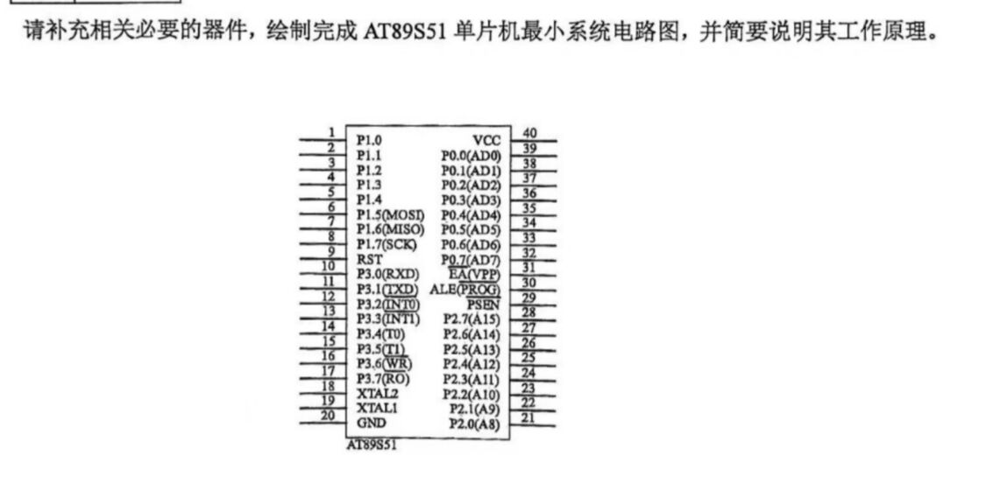

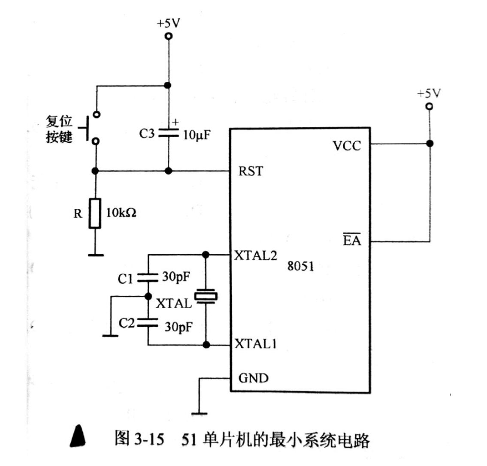

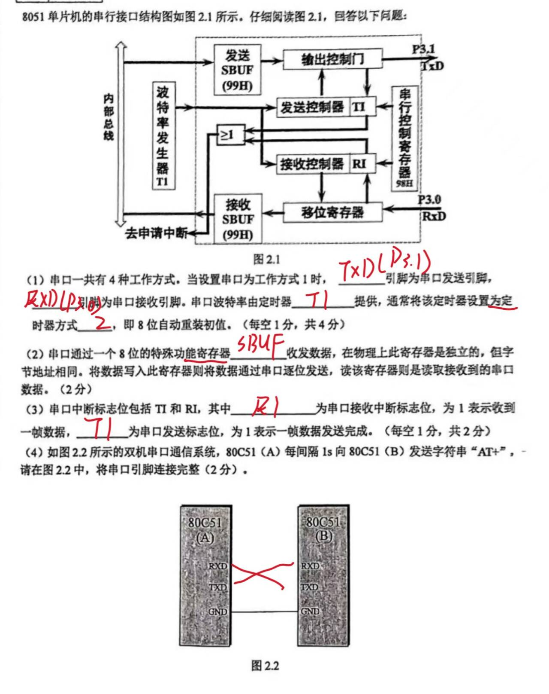

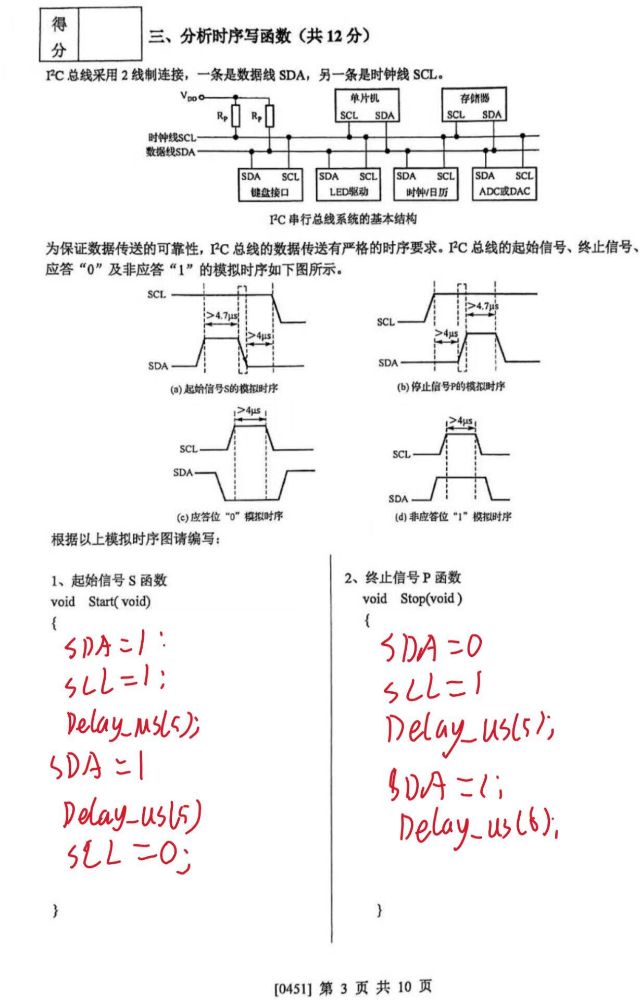

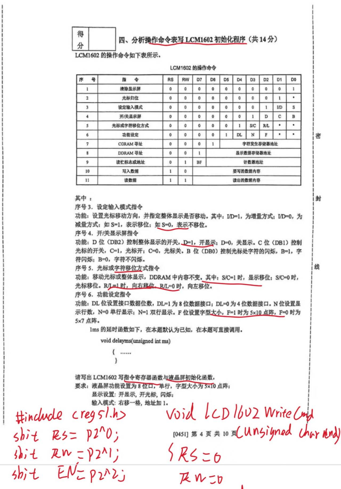

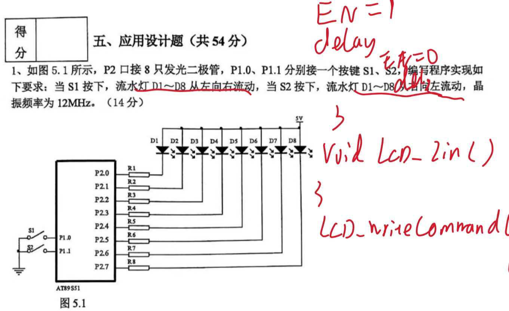

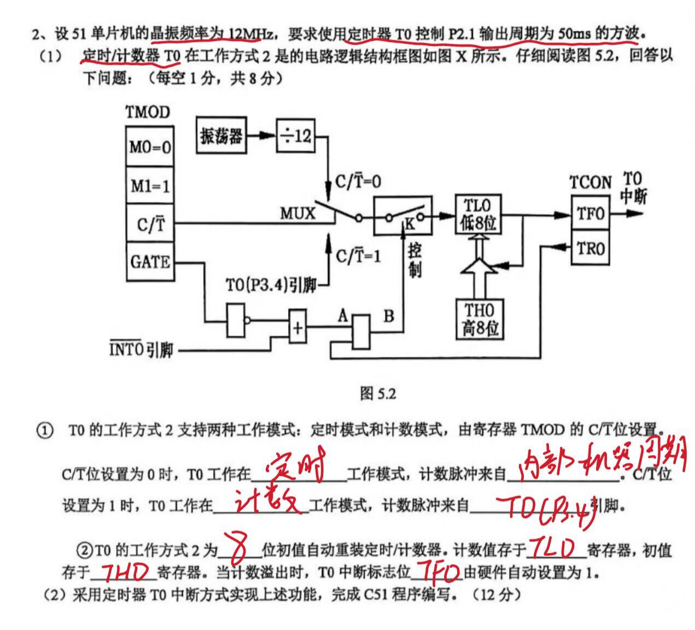

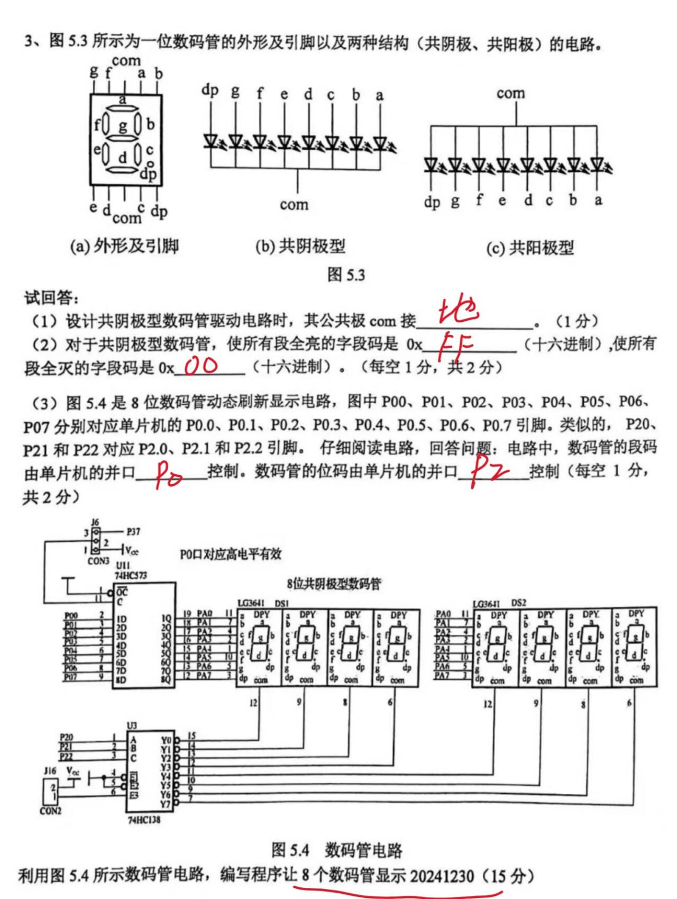

